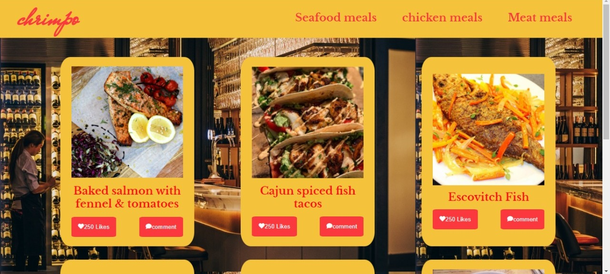

# CapstoneJS

A JavaScript project for the Leaderboard list app, using webpack and ES6 features.The leaderboard website displays scores submitted by different players. It also allows us to submit our score. All data is preserved thanks to the external Leaderboard API service.

![image] 

## Video link

[loom Link] (https://loom.com/share/cebf106ada4f4ac789399a6eb27dd385)

## Live Demo

[Live Demo Link]

## Built With

- HTML
- CSS
- JS
- WEBPACK
- API service

## Getting Started

**To clone this project**
**Run command: $git clone the reposiratory**
**or press the green Code button in the upper right corner and choose to download from the Download ZIP link.**
**To setup the webpack for this project**

#### Install Webpack

- Follow the instructions from the [getting started](https://webpack.js.org/guides/getting-started/#basic-setup) guide to set up the basics. Implement all the steps from _Basic Setup_ to _NPM Scripts_.
- The next step is to add html file :
  Follow the instructions from the [setting up HtmlWebpackPlugin](https://webpack.js.org/guides/output-management/#setting-up-htmlwebpackplugin) guide
  Then

```
npm run build
```

- Create a **/src/index.html** for writing the project

- Then modify **webpack.config.js** to point HtmlWebpackPlugin towards your template file:

```javascript
plugins: [
  new HtmlWebpackPlugin({
-   title: 'Output Management',
+   template: './src/index.html'
  }),
],
```

- Run `npm run build` to update the **/dist/index.html**.
- Then it is time to add some style to the project:
  Follow the steps in [loading CSS](https://webpack.js.org/guides/asset-management/#loading-css) guide.
  Next, execute `npm run build` and check if the HTML body style has changed.

#### Setup local dev server

- Finally,follow the [using webpack-dev-server](https://webpack.js.org/guides/development/#using-webpack-dev-server) guide and set it up on your local machine.

## Prerequisites

- Code editor (VS Code)

## Authors

👤 Aku khan

- GitHub: [@aakbarkhan](https://github.com/aakbarkhan)
- LinkedIn: [Aku khan](https://www.linkedin.com/in/akbar-khan-b57709182/)

👤 Farouq Daif

- GitHub: [@farouqdaif1](https://github.com/farouqdaif1)
- LinkedIn: [Farouq Daif](https://www.linkedin.com/in/farouqdaif/https://www.linkedin.com/in/farouqdaif/)

## Show your support

Give a ⭐️ if you like this project!

## 📝 License

This project is [MIT](./MIT.md) licensed.
